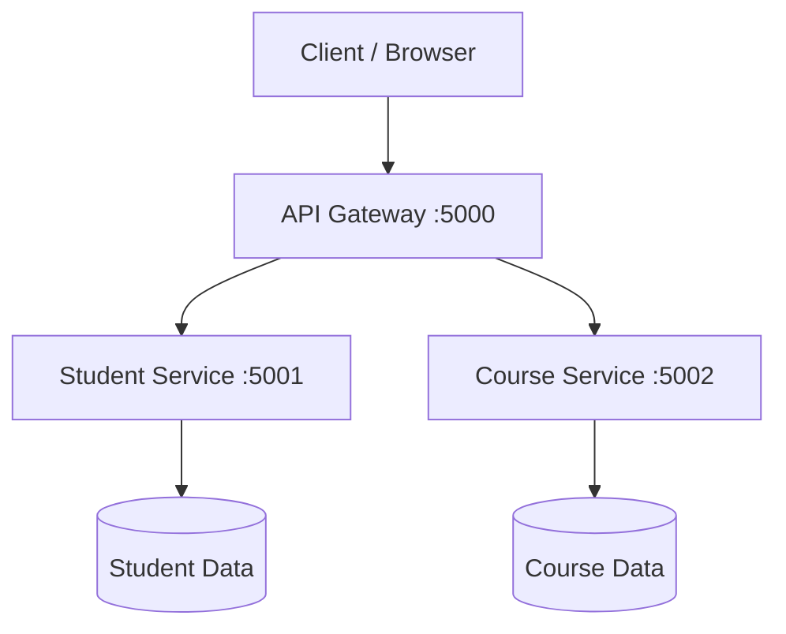
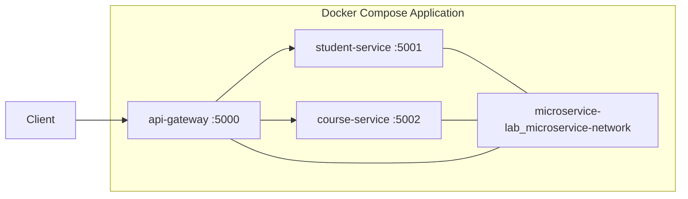
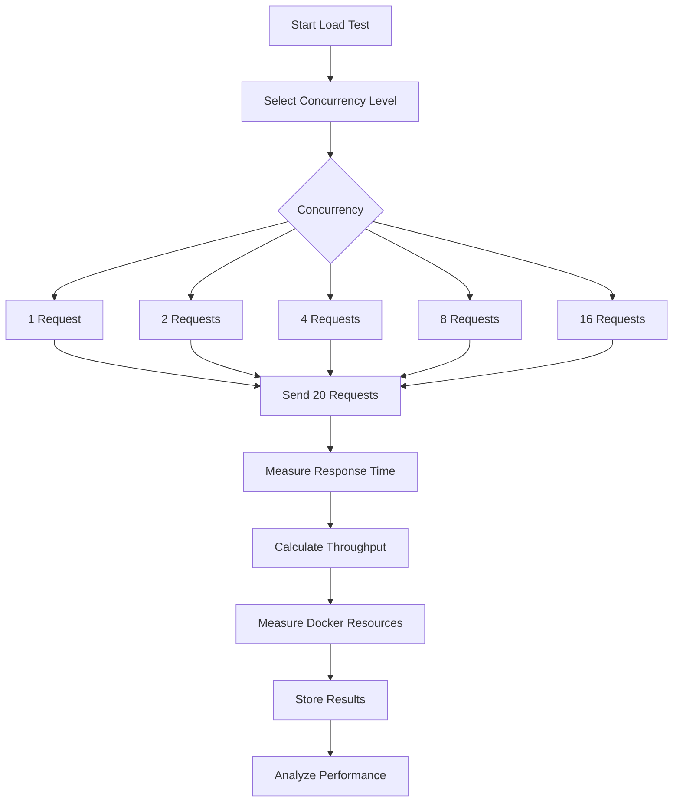
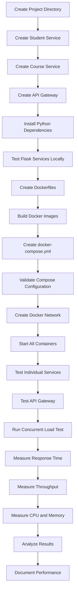

<div align="center">

# 🚀 Cloud Computing & Docker Microservices Lab

### Virtualization • Containerization • Microservices • Docker Compose • Load Testing • Performance Analysis


</div>

---

# 📚 Table of Contents

- [About the Repository](#-about-the-repository)
- [Experiments Overview](#-experiments-overview)
- [Experiment 01 — Hypervisor Performance Analysis](#-experiment-01--hypervisor-performance-analysis)
- [Experiment 02 — Dockerized Microservices](#-experiment-02--dockerized-microservices)
- [System Architecture](#-system-architecture)
- [Technology Stack](#-technology-stack)
- [Microservice Components](#-microservice-components)
- [Repository Structure](#-repository-structure)
- [Dockerization](#-dockerization)
- [Docker Compose Deployment](#-docker-compose-deployment)
- [Inter-Service Communication](#-inter-service-communication)
- [API Endpoints](#-api-endpoints)
- [Load Testing](#-load-testing)
- [Performance Results](#-performance-results)
- [Docker Resource Utilization](#-docker-resource-utilization)
- [Performance Analysis](#-performance-analysis)
- [Theoretical Analysis](#-theoretical-analysis)
- [Scalability Analysis](#-scalability-analysis)
- [Terminal Verification](#-terminal-verification)
- [Complete Execution Flow](#-complete-execution-flow)
- [Reproduction Guide](#-reproduction-guide)
- [Troubleshooting](#-troubleshooting)
- [Learning Outcomes](#-learning-outcomes)
- [Future Improvements](#-future-improvements)
- [Conclusion](#-conclusion)
- [License](#-license)

---

# 🌐 About the Repository

This repository contains practical **Cloud Computing and Virtualization laboratory experiments** covering traditional virtualization, containerization, microservices, orchestration, networking, concurrent workload testing, and performance analysis.

The experiments progress from virtual machine virtualization to a complete Dockerized microservice architecture.

The repository demonstrates:

- Virtualization concepts
- Type-1 and Type-2 hypervisors
- Proxmox VE
- VMware Workstation
- Ubuntu virtual machines
- CPU benchmarking using Sysbench
- Docker containerization
- Python Flask REST APIs
- Docker image creation
- Docker Compose orchestration
- Docker bridge networking
- API Gateway architecture
- Inter-service communication
- Concurrent request processing
- Load testing
- Response-time measurement
- Throughput measurement
- CPU utilization monitoring
- Memory utilization monitoring
- Performance and scalability analysis

The overall workflow is:

```text
Virtualization
      │
      ▼
Virtual Machine Performance
      │
      ▼
Containerization
      │
      ▼
Independent REST Microservices
      │
      ▼
Docker Images
      │
      ▼
Docker Compose
      │
      ▼
Inter-Service Communication
      │
      ▼
Concurrent Load Testing
      │
      ▼
Performance + Resource Analysis
```

---

# 🧪 Experiments Overview

| Experiment | Domain | Main Technologies | Objective |
|---|---|---|---|
| **Experiment 01** | Virtualization | Proxmox VE, VMware Workstation, Ubuntu, Sysbench | Compare virtualization environments and analyze CPU performance |
| **Experiment 02** | Containerization & Microservices | Python, Flask, Docker, Docker Compose | Build, deploy, communicate and evaluate a three-service microservice architecture |

---

# 🖥️ Experiment 01 — Hypervisor Performance Analysis

## 1. Experiment Title

**Performance Analysis of Type-1 and Type-2 Hypervisors**

## 2. Aim

To create and configure equivalent Ubuntu virtual machines on a **Type-1 hypervisor using Proxmox VE** and a **Type-2 hypervisor using VMware Workstation**, and compare their CPU performance using the **Sysbench CPU benchmark**.

## 3. Objectives

1. Understand virtualization and hypervisors.
2. Study Type-1 and Type-2 hypervisors.
3. Configure an Ubuntu VM on Proxmox VE.
4. Configure an Ubuntu VM on VMware Workstation.
5. Allocate equivalent virtual hardware resources.
6. Install and execute Sysbench CPU benchmarks.
7. Record CPU performance metrics.
8. Compare benchmark results.
9. Analyze virtualization overhead.
10. Document experimental observations.

## 4. Virtualization

Virtualization abstracts physical computing resources and presents them as virtual resources to virtual machines.

The major resources involved are:

- CPU
- Memory
- Storage
- Network interfaces

A Virtual Machine provides an isolated computing environment containing:

- Virtual CPU
- Virtual memory
- Virtual disk
- Virtual network interface
- Guest operating system

## 5. Hypervisor Types

### Type-1 Hypervisor

A Type-1 hypervisor, also known as a **bare-metal hypervisor**, runs directly on physical hardware.

In this experiment:

> **Proxmox VE** is used as the Type-1 virtualization platform.

```text
┌─────────────────────────────────────────────┐
│              Virtual Machines               │
│                                             │
│       ┌────────────┐   ┌────────────┐       │
│       │ Ubuntu VM  │   │ Ubuntu VM  │       │
│       └────────────┘   └────────────┘       │
├─────────────────────────────────────────────┤
│              Proxmox VE                     │
│           Type-1 Hypervisor                 │
├─────────────────────────────────────────────┤
│             Physical Hardware              │
│          CPU / RAM / Storage                │
└─────────────────────────────────────────────┘
```

### Type-2 Hypervisor

A Type-2 hypervisor runs as an application on top of a host operating system.

In this experiment:

> **VMware Workstation** is used as the Type-2 virtualization platform.

```text
┌─────────────────────────────────────────────┐
│              Virtual Machine                │
│                Ubuntu VM                    │
├─────────────────────────────────────────────┤
│          VMware Workstation                 │
│            Type-2 Hypervisor                │
├─────────────────────────────────────────────┤
│            Host Operating System            │
├─────────────────────────────────────────────┤
│             Physical Hardware              │
│          CPU / RAM / Storage                │
└─────────────────────────────────────────────┘
```

## 6. Hypervisor Comparison

| Parameter | Type-1 | Type-2 |
|---|---|---|
| Virtualization Layer | Directly on hardware | On top of host OS |
| Platform Used | Proxmox VE | VMware Workstation |
| Host OS Dependency | Lower | Higher |
| Typical Usage | Servers / Data Centers | Desktop / Development |
| Additional Host OS Layer | No | Yes |
| Experiment Role | Bare-metal virtualization | Hosted virtualization |

## 7. Sysbench CPU Benchmark

The CPU benchmark was performed using Sysbench.

Important performance parameters include:

| Metric | Meaning |
|---|---|
| Total Events | Total number of completed benchmark events |
| Total Time | Total benchmark execution time |
| Events/sec | Number of events processed per second |
| Latency | Time required to complete individual events |

### Experiment 01 Actual Measurements

The numerical Sysbench output values were **not available in the supplied experiment data used to construct this README**.

No benchmark values are fabricated here.

| Metric | Proxmox VE | VMware Workstation |
|---|---:|---:|
| Total Events | `[NOT PROVIDED]` | `[NOT PROVIDED]` |
| Total Time | `[NOT PROVIDED]` | `[NOT PROVIDED]` |
| Events/sec | `[NOT PROVIDED]` | `[NOT PROVIDED]` |
| Average Latency | `[NOT PROVIDED]` | `[NOT PROVIDED]` |

> Replace the `[NOT PROVIDED]` fields with the actual Sysbench measurements if the Experiment 01 output is available.

---

# 🐳 Experiment 02 — Dockerized Microservices

## 1. Experiment Title

**Containerized Microservices using Docker and Docker Compose**

## 2. Aim

To design, containerize, deploy and evaluate a three-service REST microservice architecture using **Python Flask, Docker and Docker Compose**, with an API Gateway communicating with Student and Course services.

## 3. Objectives

1. Develop independent Flask REST services.
2. Containerize each service using Docker.
3. Create individual Docker images.
4. Create a Docker Compose configuration.
5. Create a Docker bridge network.
6. Deploy all services together.
7. Establish service-to-service communication.
8. Implement an API Gateway.
9. Test individual service endpoints.
10. Perform concurrent load testing.
11. Measure response time.
12. Measure throughput.
13. Monitor CPU and memory utilization.
14. Analyze scalability and performance.

---

# 🏗️ System Architecture



### Simplified Architecture

```text
                    ┌─────────────────┐
                    │     Client      │
                    │ Browser / HTTP  │
                    └────────┬────────┘
                             │
                             ▼
                    ┌─────────────────┐
                    │  API Gateway    │
                    │    :5000        │
                    └───────┬─┬───────┘
                            │ │
                 ┌──────────┘ └──────────┐
                 ▼                       ▼
       ┌─────────────────┐     ┌─────────────────┐
       │ Student Service │     │ Course Service  │
       │     :5001       │     │     :5002       │
       └─────────────────┘     └─────────────────┘
                 │                       │
                 └───────────┬───────────┘
                             ▼
                Docker Bridge Network
```

---

# 🛠️ Technology Stack

| Category | Technology |
|---|---|
| Programming Language | Python 3.12 |
| Web Framework | Flask |
| Containerization | Docker |
| Orchestration | Docker Compose |
| Networking | Docker Bridge Network |
| HTTP Communication | REST / HTTP |
| HTTP Client | Python Requests |
| Concurrent Testing | ThreadPoolExecutor |
| Resource Monitoring | Docker Stats |
| Terminal | Windows PowerShell |
| Browser Testing | Google Chrome |
| Version Control | Git / GitHub |

---

# 🔧 Microservice Components

## 1. Student Service

The Student Service provides student-related information.

### Port

```text
5001
```

### Students Endpoint

```text
GET /students
```

Actual response observed during testing:

```json
{
  "service": "Student Service",
  "students": [
    {
      "branch": "AIML",
      "id": 1,
      "name": "Preetam"
    },
    {
      "branch": "AIML",
      "id": 2,
      "name": "Sai"
    },
    {
      "branch": "AIML",
      "id": 3,
      "name": "Amit"
    }
  ]
}
```

---

## 2. Course Service

The Course Service provides course-related information.

### Port

```text
5002
```

### Courses Endpoint

```text
GET /courses
```

Actual course data observed:

```json
{
  "courses": [
    {
      "credits": 4,
      "id": 101,
      "name": "Machine Learning"
    },
    {
      "credits": 3,
      "id": 102,
      "name": "Computer Networks"
    },
    {
      "credits": 4,
      "id": 103,
      "name": "Database Management Systems"
    }
  ],
  "service": "Course Service"
}
```

---

## 3. API Gateway

The API Gateway provides a single entry point for the client.

### Port

```text
5000
```

The Gateway communicates with:

```text
Student Service → http://student-service:5001
Course Service  → http://course-service:5002
```

Docker Compose environment variables:

```text
STUDENT_SERVICE_URL=http://student-service:5001
COURSE_SERVICE_URL=http://course-service:5002
```

---

# 📁 Repository Structure

```text
microservice-lab/
│
├── api-gateway/
│   ├── app.py
│   ├── requirements.txt
│   └── Dockerfile
│
├── student-service/
│   ├── app.py
│   ├── requirements.txt
│   └── Dockerfile
│
├── course-service/
│   ├── app.py
│   ├── requirements.txt
│   └── Dockerfile
│
├── docker-compose.yml
├── load_test.py
├── performance_test.py
│
├── assets/
│   ├── screenshots/
│   │   ├── experiment-01/
│   │   └── loadtest/
│   │       └── results/
│   │
│   └── diagrams/
│
├── .gitignore
├── LICENSE
└── README.md
```

---

# 🐋 Dockerization

Each microservice was converted into an independent Docker image.

Representative Dockerfile:

```dockerfile
FROM python:3.12-slim

WORKDIR /app

COPY requirements.txt .

RUN pip install --no-cache-dir -r requirements.txt

COPY app.py .

EXPOSE 5000

CMD ["python", "app.py"]
```

The same containerization concept was applied to the three services with their appropriate application and port configuration.

---

# 🖼️ Docker Images

| Service | Docker Image | Version |
|---|---|---|
| Student Service | `student-service` | `v1` |
| Course Service | `course-service` | `v1` |
| API Gateway | `api-gateway` | `v1` |

Verification:

```powershell
docker images
```

Observed local images included:

```text
student-service:v1
course-service:v1
api-gateway:v1
```

---

# 🌐 Docker Compose Deployment

The complete application was deployed using:

```powershell
docker compose up -d
```

Docker Compose created:

```text
microservice-lab_microservice-network
```

The bridge network allowed containers to communicate using service names instead of localhost.

---

# 🔗 Docker Compose Architecture



---

# 🚀 Compose Services

| Service | Container Name | Image | Host Port | Container Port |
|---|---|---|---:|---:|
| API Gateway | `api-gateway` | `api-gateway:v1` | 5000 | 5000 |
| Student Service | `student-service` | `student-service:v1` | 5001 | 5001 |
| Course Service | `course-service` | `course-service:v1` | 5002 | 5002 |

---

# 🔍 Docker Compose Verification

The Compose configuration was verified using:

```powershell
docker compose config
```

The resulting configuration confirmed:

- Three services
- API Gateway dependencies
- Student Service
- Course Service
- Published ports
- Environment variables
- Docker bridge network

---

# 📡 Inter-Service Communication

The API Gateway does not communicate with backend services through `localhost`.

Inside the Docker network, the services are addressed using their Compose service names:

```text
http://student-service:5001
http://course-service:5002
```

### Communication Flow

```text
Client
  │
  │ HTTP
  ▼
API Gateway :5000
  │
  ├──────────── HTTP ────────────► Student Service :5001
  │
  └──────────── HTTP ────────────► Course Service :5002
```

---

# 🔌 API Endpoints

| Service | Endpoint | Purpose |
|---|---|---|
| Student | `/health` | Service health |
| Student | `/students` | Retrieve students |
| Course | `/health` | Service health |
| Course | `/courses` | Retrieve courses |
| API Gateway | `/health` | Gateway health |
| API Gateway | `/dashboard` | Combined service response |

---

# 🧪 API Gateway Verification

The API Gateway was successfully tested through:

```text
http://localhost:5000/dashboard
```

The response confirmed successful communication with both backend services.

The dashboard response contained:

- Course information
- Student information
- Service status
- Gateway communication confirmation

Observed message:

```text
API Gateway successfully communicated with Student and Course Services
```

---

# 🧪 Load Testing

A Python-based load testing program was used to evaluate the API Gateway under increasing concurrent workloads.

The workloads tested were:

```text
1 concurrent request
2 concurrent requests
4 concurrent requests
8 concurrent requests
16 concurrent requests
```

Each workload generated:

```text
20 requests
```

The test measured:

- Successful requests
- Failed requests
- Average response time
- Throughput
- Total test time
- Docker CPU usage
- Docker memory usage

---

# 📊 Load Testing Methodology



---

# 📈 Performance Results

## Complete Observation Table

| Workload | Concurrent Requests | Successful Requests | Failed Requests | Avg Response Time (s) | Throughput (requests/sec) |
|---|---:|---:|---:|---:|---:|
| W1 | 1 | 20 | 0 | 0.0342 | 29.03 |
| W2 | 2 | 20 | 0 | 0.0264 | 74.13 |
| W3 | 4 | 20 | 0 | 0.0278 | 128.13 |
| W4 | 8 | 20 | 0 | 0.0481 | **149.74** |
| W5 | 16 | 20 | 0 | 0.1204 | 91.98 |

---

# 📊 Visual Throughput Comparison

```text
Concurrent Requests     Throughput

1                       ██████                         29.03 req/s
2                       ███████████████                74.13 req/s
4                       █████████████████████████      128.13 req/s
8                       ██████████████████████████████ 149.74 req/s
16                      ███████████████████            91.98 req/s
```

### Peak Throughput

```text
149.74 requests/sec
```

The highest measured throughput occurred at:

```text
8 concurrent requests
```

---

# ⏱️ Response Time Analysis

| Concurrent Requests | Average Response Time |
|---:|---:|
| 1 | 0.0342 s |
| 2 | 0.0264 s |
| 4 | 0.0278 s |
| 8 | 0.0481 s |
| 16 | 0.1204 s |

The lowest measured average response time was:

```text
0.0264 seconds
```

at:

```text
2 concurrent requests
```

The highest measured average response time was:

```text
0.1204 seconds
```

at:

```text
16 concurrent requests
```

---

# 🏆 Overall Load-Test Results

| Parameter | Result |
|---|---:|
| Total Requests | **100** |
| Successful Requests | **100** |
| Failed Requests | **0** |
| Overall Failure Rate | **0%** |
| Peak Throughput | **149.74 requests/sec** |
| Peak Throughput Workload | **8 concurrent requests** |
| Lowest Avg Response Time | **0.0264 s** |
| Lowest Response-Time Workload | **2 concurrent requests** |
| Highest Avg Response Time | **0.1204 s** |
| Highest Response-Time Workload | **16 concurrent requests** |

---

# 📊 Performance Visualization

Place the actual terminal result screenshots generated during the experiment inside:

```text
assets/screenshots/loadtest/results/
```

Recommended organization:

```text
assets/
└── screenshots/
    └── loadtest/
        └── results/
            ├── load-test-results.png
            ├── performance-results.png
            └── resource-usage.png
```

Embed the actual screenshots using:

```markdown

```

```markdown

```

> Use the actual filenames present in the repository.

---

# 🐳 Docker Resource Utilization

Docker resource utilization was measured while executing the performance test.

The monitored containers were:

- API Gateway
- Student Service
- Course Service

---

# 📋 Resource Observation Table

| Workload | API Gateway CPU | API Gateway Memory | Student CPU | Student Memory | Course CPU | Course Memory |
|---|---:|---:|---:|---:|---:|---:|
| W1 | 0.02% | 25.98 MiB | 0.02% | 22.07 MiB | 0.02% | 21.77 MiB |
| W2 | 0.02% | 26.07 MiB | 0.02% | 22.05 MiB | 0.02% | 21.77 MiB |
| W3 | 0.02% | 26.00 MiB | 0.02% | 22.04 MiB | 0.02% | 21.78 MiB |
| W4 | 0.01% | 26.05 MiB | 0.02% | 22.05 MiB | 0.01% | 21.76 MiB |
| W5 | 0.02% | 26.05 MiB | 0.02% | 22.05 MiB | 0.02% | 21.79 MiB |

---

# 📌 Resource Usage Observations

### API Gateway

CPU utilization remained:

```text
0.01% – 0.02%
```

Memory utilization remained approximately:

```text
25.98 – 26.07 MiB
```

### Student Service

CPU utilization remained approximately:

```text
0.02%
```

Memory remained approximately:

```text
22.04 – 22.07 MiB
```

### Course Service

CPU utilization remained approximately:

```text
0.01% – 0.02%
```

Memory remained approximately:

```text
21.76 – 21.79 MiB
```

---

# 📉 Performance Analysis

## 1. Increasing Concurrency

Throughput increased significantly as concurrency increased from 1 to 8 requests.

| Concurrency | Throughput |
|---:|---:|
| 1 | 29.03 |
| 2 | 74.13 |
| 4 | 128.13 |
| 8 | **149.74** |

This indicates that the application benefited from concurrent request processing within this tested workload range.

## 2. Peak Performance

The maximum measured throughput was:

```text
149.74 requests/sec
```

at:

```text
8 concurrent requests
```

Therefore, within the tested workloads, **8 concurrent requests produced the highest throughput**.

## 3. Performance Degradation at 16 Requests

When concurrency increased from 8 to 16:

```text
Throughput:
149.74 → 91.98 requests/sec
```

At the same time:

```text
Average Response Time:
0.0481 s → 0.1204 s
```

This indicates that increasing concurrency beyond the observed optimal workload did not continue to improve throughput.

---

# 📐 Theoretical Analysis

## Amdahl's Law

Amdahl's Law describes the theoretical speedup obtainable by parallelizing part of a workload:

\[
S(N)=\frac{1}{(1-P)+\frac{P}{N}}
\]

Where:

- \(S(N)\) = theoretical speedup
- \(P\) = parallelizable fraction
- \(N\) = number of parallel workers

Although this experiment is a microservice load test rather than a traditional CPU-parallel benchmark, the same principle helps explain why increasing concurrency does not guarantee unlimited performance improvement.

## Concurrency vs Throughput

```text
More Concurrency
       │
       ▼
More Simultaneous Work
       │
       ▼
Higher Throughput
       │
       ▼
System Saturation
       │
       ▼
Higher Response Time
       │
       ▼
Lower Throughput
```

The experiment observed this behavior when moving from:

```text
8 concurrent requests
```

to:

```text
16 concurrent requests
```

---

# 🧠 Bottlenecks and Performance Factors

Potential factors affecting microservice performance include:

### 1. Request Processing Overhead

Every HTTP request introduces processing overhead at the API Gateway and backend services.

### 2. Network Communication

The API Gateway communicates with two backend services over the Docker bridge network.

```text
Client
  ↓
API Gateway
  ↓
Student / Course Services
```

### 3. Concurrency Overhead

Higher concurrency can increase scheduling and request-management overhead.

### 4. Resource Contention

As concurrent workload increases, processes may compete for CPU, memory, network and other system resources.

### 5. Service Coordination

The API Gateway must coordinate communication with both backend services before returning the combined response.

---

# 🔎 Verification Summary

| Verification | Status |
|---|---|
| Student Service starts | ✅ PASS |
| Course Service starts | ✅ PASS |
| API Gateway starts | ✅ PASS |
| Student `/health` endpoint | ✅ PASS |
| Course `/health` endpoint | ✅ PASS |
| Student `/students` endpoint | ✅ PASS |
| Course `/courses` endpoint | ✅ PASS |
| API Gateway `/dashboard` | ✅ PASS |
| Docker image creation | ✅ PASS |
| Docker Compose configuration | ✅ PASS |
| Docker bridge network | ✅ PASS |
| Inter-service communication | ✅ PASS |
| Load testing | ✅ PASS |
| Concurrent workloads | ✅ PASS |
| Resource monitoring | ✅ PASS |
| Failed requests during load test | **0** |

---

# 🖥️ Terminal Verification

## Docker Images

Verification command:

```powershell
docker images
```

Verified images:

```text
student-service:v1
course-service:v1
api-gateway:v1
```

## Docker Compose

```powershell
docker compose config
```

Deployment:

```powershell
docker compose up -d
```

## Running Containers

```powershell
docker ps
```

Expected services:

```text
api-gateway
student-service
course-service
```

Observed port mappings:

```text
api-gateway      5000 → 5000
student-service  5001 → 5001
course-service   5002 → 5002
```

## Docker Resource Monitoring

```powershell
docker stats --no-stream
```

---

# 🔄 Complete Execution Flow



---

# 🚀 Reproduction Guide

## Step 1 — Clone the Repository

```bash
git clone <YOUR_GITHUB_REPOSITORY_URL>
cd microservice-lab
```

## Step 2 — Verify Docker

```powershell
docker --version
docker compose version
```

## Step 3 — Build Student Service

```powershell
cd student-service
docker build -t student-service:v1 .
cd ..
```

## Step 4 — Build Course Service

```powershell
cd course-service
docker build -t course-service:v1 .
cd ..
```

## Step 5 — Build API Gateway

```powershell
cd api-gateway
docker build -t api-gateway:v1 .
cd ..
```

## Step 6 — Verify Images

```powershell
docker images
```

## Step 7 — Validate Docker Compose

```powershell
docker compose config
```

## Step 8 — Start the Microservices

```powershell
docker compose up -d
```

## Step 9 — Verify Containers

```powershell
docker ps
```

## Step 10 — Test Student Service

```text
http://localhost:5001/health
http://localhost:5001/students
```

## Step 11 — Test Course Service

```text
http://localhost:5002/health
http://localhost:5002/courses
```

## Step 12 — Test API Gateway

```text
http://localhost:5000/health
http://localhost:5000/dashboard
```

## Step 13 — Run Load Test

```powershell
python load_test.py
```

## Step 14 — Monitor Docker Resources

```powershell
docker stats --no-stream
```

## Step 15 — Run Performance Test

```powershell
python performance_test.py
```

## Step 16 — Stop the Application

```powershell
docker compose down
```

---

# 🧰 Troubleshooting

## Docker Daemon Not Running

If Docker returns:

```text
failed to connect to the docker API
```

start Docker Desktop and wait until the Docker engine is running.

Verify:

```powershell
docker info
```

## Port Already in Use

Check:

```powershell
docker ps
```

Stop a conflicting container:

```powershell
docker stop <container-name>
```

## Container Not Running

Check:

```powershell
docker ps -a
```

View logs:

```powershell
docker logs <container-name>
```

## API Gateway Cannot Reach Backend Services

Check networks:

```powershell
docker network ls
```

Inspect the project network:

```powershell
docker network inspect microservice-lab_microservice-network
```

## Rebuild Containers

```powershell
docker compose down
docker compose build
docker compose up -d
```

---

# 📸 Experimental Evidence

Recommended screenshot organization:

```text
assets/
└── screenshots/
    ├── experiment-01/
    │   ├── proxmox/
    │   ├── vmware/
    │   └── sysbench/
    │
    └── loadtest/
        ├── services/
        ├── docker/
        ├── results/
        └── resource-usage/
```

| Evidence | Purpose |
|---|---|
| Proxmox screenshot | Type-1 virtualization proof |
| VMware screenshot | Type-2 virtualization proof |
| Sysbench output | Experiment 01 benchmark proof |
| Docker images | Image creation proof |
| Docker Compose output | Deployment proof |
| `docker ps` | Running container proof |
| Service endpoints | REST API proof |
| API Gateway dashboard | Inter-service communication proof |
| Load-test output | Performance proof |
| Docker stats | Resource utilization proof |

---

# 📊 Final Experimental Summary

| Category | Result |
|---|---|
| Microservices | **3** |
| API Gateway | **1** |
| Backend Services | **2** |
| Docker Images | **3** |
| Docker Compose | **Successfully deployed** |
| Docker Network | **Bridge network** |
| API Gateway Port | **5000** |
| Student Service Port | **5001** |
| Course Service Port | **5002** |
| Total Load-Test Requests | **100** |
| Successful Requests | **100** |
| Failed Requests | **0** |
| Failure Rate | **0%** |
| Peak Throughput | **149.74 requests/sec** |
| Peak Throughput Concurrency | **8** |
| Maximum Avg Response Time | **0.1204 s** |
| Maximum Response-Time Workload | **16 concurrent requests** |

---

# 🎯 Key Observations

### Observation 1 — Successful Containerization

All three Flask applications were successfully converted into Docker images.

### Observation 2 — Successful Orchestration

Docker Compose successfully created and started:

```text
api-gateway
student-service
course-service
```

### Observation 3 — Successful Service Discovery

The API Gateway successfully communicated with backend services using Docker Compose service names.

### Observation 4 — Successful API Integration

The `/dashboard` endpoint successfully returned information from both Student and Course services.

### Observation 5 — Reliable Load-Test Execution

All tested workloads completed with:

```text
20 successful requests
0 failed requests
```

for each concurrency level.

### Observation 6 — Peak Throughput

The highest measured throughput was:

```text
149.74 requests/sec
```

at:

```text
8 concurrent requests
```

### Observation 7 — Higher Concurrency Is Not Always Better

At 16 concurrent requests, throughput decreased to:

```text
91.98 requests/sec
```

while average response time increased to:

```text
0.1204 seconds
```

This demonstrates the importance of identifying the effective operating range rather than assuming that continuously increasing concurrency will always improve performance.

---

# 🧠 Learning Outcomes

Through these experiments, the following concepts were demonstrated:

- Virtualization
- Type-1 hypervisors
- Type-2 hypervisors
- Virtual machine deployment
- CPU benchmarking
- Containerization
- Docker images
- Docker containers
- Dockerfiles
- Flask REST APIs
- Microservice architecture
- API Gateway pattern
- Docker Compose
- Docker bridge networking
- Container service discovery
- Inter-service communication
- Concurrent request processing
- Load testing
- Throughput analysis
- Response-time analysis
- CPU monitoring
- Memory monitoring
- Scalability analysis
- Performance bottleneck identification
- Reproducible deployment

---

# 🔮 Future Improvements

The current implementation can be extended with:

### 1. Database Integration

Introduce persistent databases for Student and Course services.

### 2. Authentication

Add:

```text
JWT Authentication
Role-Based Access Control
```

### 3. API Documentation

Integrate:

```text
OpenAPI / Swagger
```

### 4. Observability

Add:

```text
Prometheus
Grafana
Centralized Logging
Distributed Tracing
```

### 5. Production WSGI Server

Replace Flask's development server with a production server such as:

```text
Gunicorn
```

### 6. Horizontal Scaling

Run multiple replicas:

```text
API Gateway × N
Student Service × N
Course Service × N
```

and place a load balancer in front of them.

### 7. CI/CD

Introduce automated:

```text
Build
Test
Docker Image Creation
Security Scanning
Deployment
```

### 8. Kubernetes

The Docker Compose deployment can later be migrated to Kubernetes for production-style orchestration.

---

# 🏁 Conclusion

This laboratory project demonstrates the progression from **virtualized computing environments to containerized distributed applications**.

The first experiment introduces virtualization through Type-1 and Type-2 hypervisors and CPU benchmarking.

The second experiment extends the concepts into a practical microservice architecture consisting of:

```text
API Gateway
     │
     ├── Student Service
     │
     └── Course Service
```

The services were successfully:

```text
Developed
   ↓
Containerized
   ↓
Built as Docker Images
   ↓
Deployed with Docker Compose
   ↓
Connected through a Docker Network
   ↓
Tested through REST APIs
   ↓
Load Tested
   ↓
Monitored
   ↓
Performance Analyzed
```

The actual load-testing experiment produced:

```text
100 total requests
100 successful requests
0 failed requests
0% failure rate
149.74 requests/sec peak throughput
```

The highest throughput occurred at **8 concurrent requests**, while increasing concurrency to 16 resulted in reduced throughput and increased response time.

Therefore, the experiment successfully demonstrates the practical relationship between **containerized microservices, concurrency, throughput, response time, resource utilization and scalability**.

---

# 📜 License

This project is licensed under the **MIT License**.

See the [`LICENSE`](LICENSE) file for details.

---

<div align="center">

### 🚀 Cloud Computing • Docker • Microservices • Performance Engineering

**Built as part of a practical Cloud Computing laboratory**

</div>
