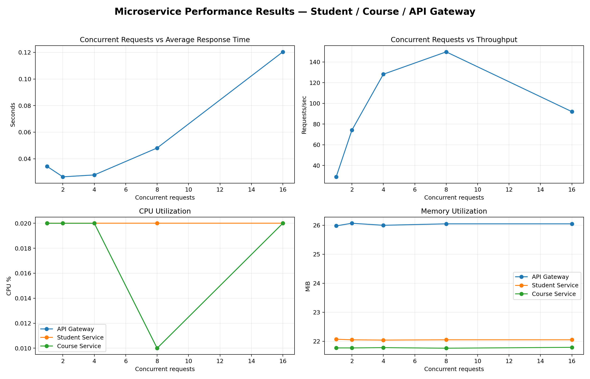
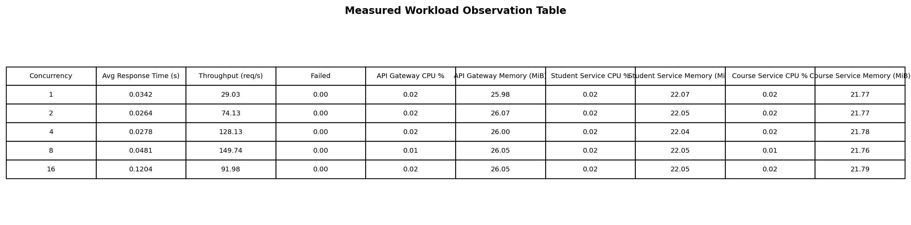
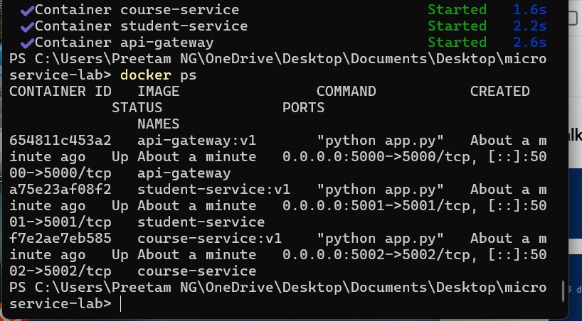
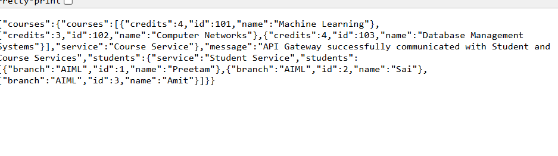
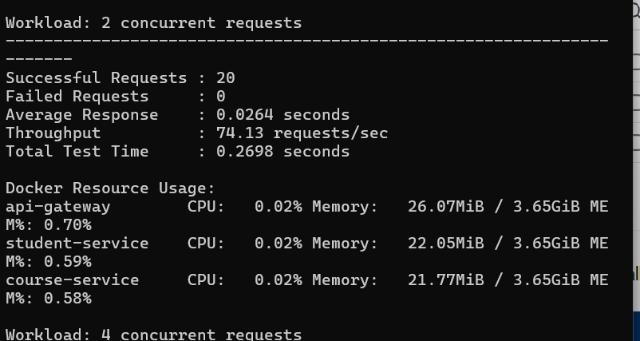
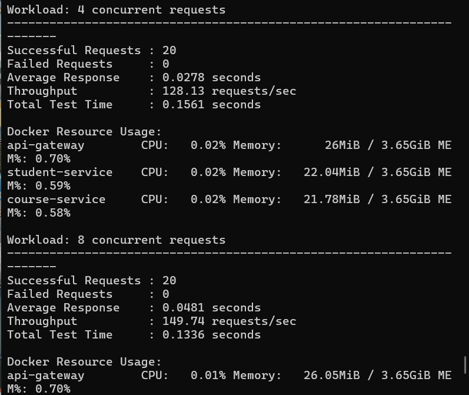
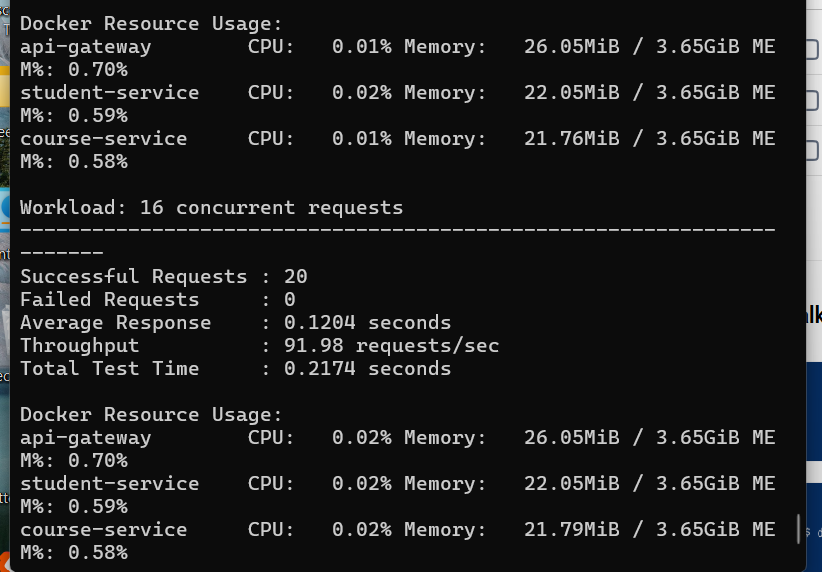

# Docker Microservices — Student & Course Services

**Course:** Cloud Computing / Containerization  
**Architecture:** API Gateway + Student Service + Course Service  
**Runtime:** Python 3.12, Flask, Docker Desktop, Docker Compose

A reproducible three-microservice lab implementation with Dockerized services, Docker Compose networking, end-to-end communication, workload testing, and measured CPU/memory observations.

## Architecture

```text
                         ┌─────────────────────┐
                         │     API Gateway      │
Client ────────────────► │      :5000           │
                         └──────────┬──────────┘
                                    │
                     ┌──────────────┴──────────────┐
                     ▼                             ▼
          ┌─────────────────────┐       ┌─────────────────────┐
          │   Student Service   │       │    Course Service   │
          │       :5001         │       │        :5002        │
          └─────────────────────┘       └─────────────────────┘

All three containers share: microservice-network
```

| Service | Responsibility | Main endpoints |
|---|---|---|
| `api-gateway` | Aggregates responses from both backend services | `GET /health`, `/students`, `/courses`, `/dashboard` |
| `student-service` | Student records | `GET /health`, `/students` |
| `course-service` | Course records | `GET /health`, `/courses` |

## Repository layout

```text
microservice-lab/
├── api-gateway/
├── student-service/
├── course-service/
├── docker-compose.yml
├── loadtest/
│   ├── loadtest.py
│   ├── performance_test.py
│   └── results/
│       ├── performance_results.png
│       ├── observation_results.png
│       ├── observation_table.csv
│       └── results.csv
└── assets/
    └── screenshots/
```

## Quickstart

```powershell
docker compose up -d
docker ps
```

Test the integrated endpoint:

```powershell
curl.exe http://localhost:5000/dashboard
```

Expected response includes:

```text
API Gateway successfully communicated with Student and Course Services
```

## Performance Evaluation

The measured workload levels were **1, 2, 4, 8 and 16 concurrent requests**, with 20 requests executed per workload.

| Workload | Concurrent | Avg response (s) | Throughput (req/s) | Failed |
|---|---:|---:|---:|---:|
| W1 | 1 | 0.0342 | 29.03 | 0 |
| W2 | 2 | 0.0264 | 74.13 | 0 |
| W3 | 4 | 0.0278 | 128.13 | 0 |
| W4 | 8 | **0.0481** | **149.74** | 0 |
| W5 | 16 | 0.1204 | 91.98 | 0 |

**Result:** 100/100 requests succeeded. Peak measured throughput was **149.74 requests/sec at 8 concurrent requests**. At 16 concurrent requests, response time increased to **0.1204 s** and throughput decreased to **91.98 requests/sec**, indicating a higher-concurrency performance limit in this test environment.

### Resource observations

| Workload | API CPU / Memory | Student CPU / Memory | Course CPU / Memory |
|---|---|---|---|
| W1 | 0.02% / 25.98 MiB | 0.02% / 22.07 MiB | 0.02% / 21.77 MiB |
| W2 | 0.02% / 26.07 MiB | 0.02% / 22.05 MiB | 0.02% / 21.77 MiB |
| W3 | 0.02% / 26.00 MiB | 0.02% / 22.04 MiB | 0.02% / 21.78 MiB |
| W4 | 0.01% / 26.05 MiB | 0.02% / 22.05 MiB | 0.01% / 21.76 MiB |
| W5 | 0.02% / 26.05 MiB | 0.02% / 22.05 MiB | 0.02% / 21.79 MiB |

## Results

### Consolidated result image



### Observation table image



Raw CSV evidence is also included in `loadtest/results/`.

## Terminal Proof

### Docker Compose deployment



### End-to-end communication



### Workload test







## Reproduce the measured workflow

```powershell
# Start the stack
docker compose up -d

# Verify containers
docker ps

# Test end-to-end communication
curl.exe http://localhost:5000/dashboard

# Run the workload script
cd loadtest
pip install requests
python performance_test.py
```

For resource monitoring in a second terminal:

```powershell
docker stats
```

## Performance interpretation

- Throughput improved from W1 through W4 and peaked at **149.74 req/s** at 8 concurrent requests.
- At W5 (16 concurrent requests), throughput dropped to **91.98 req/s** while average response time rose to **0.1204 s**.
- CPU utilization remained very low in the measured snapshot-based test.
- Memory remained stable across workloads, with the API Gateway around 26 MiB.
- No request failures were recorded in the measured run.

## Cleanup

```powershell
docker compose down
```

## License

MIT
